# maven-start
Maven项目依赖管理
### Maven简介
>* Maven:一个用于自动化构建项目和管理项目依赖的工具
>* 自动化构建项目：按照企业中主流的项目模板，创建完善的项目结构
>* 管理项目依赖：配置式添加和管理，自动下载和导入
### Maven工具和项目的文件结构
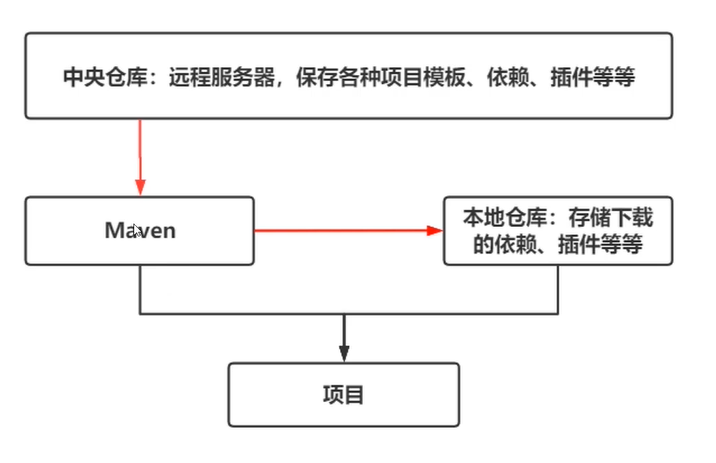
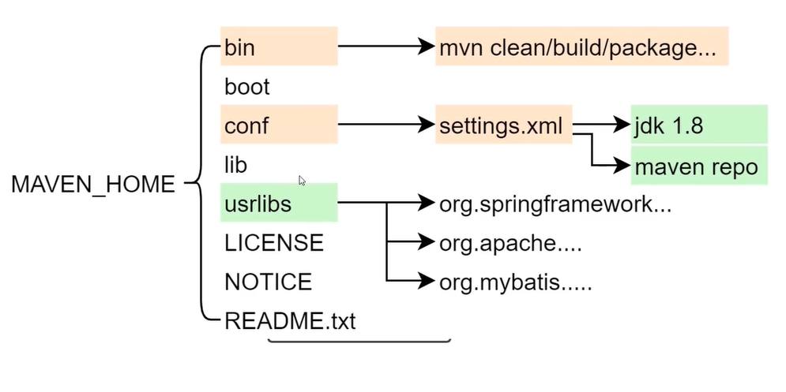
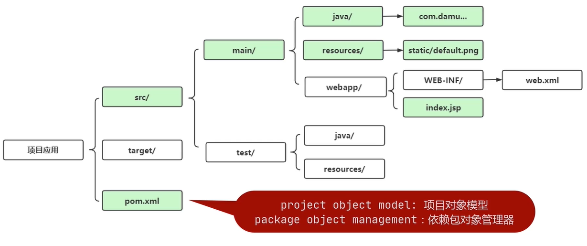
### Maven基础操作-仓库
>* 远程仓库/中央仓库
>* 本地仓库 C:/Users/用户名/.m2/respository/
>* 私有服务器（企业）
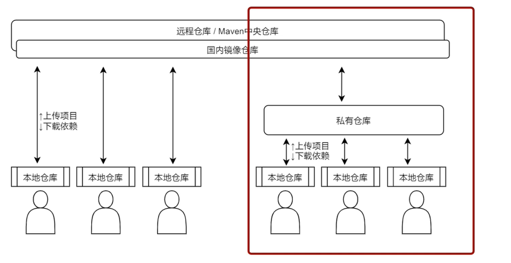
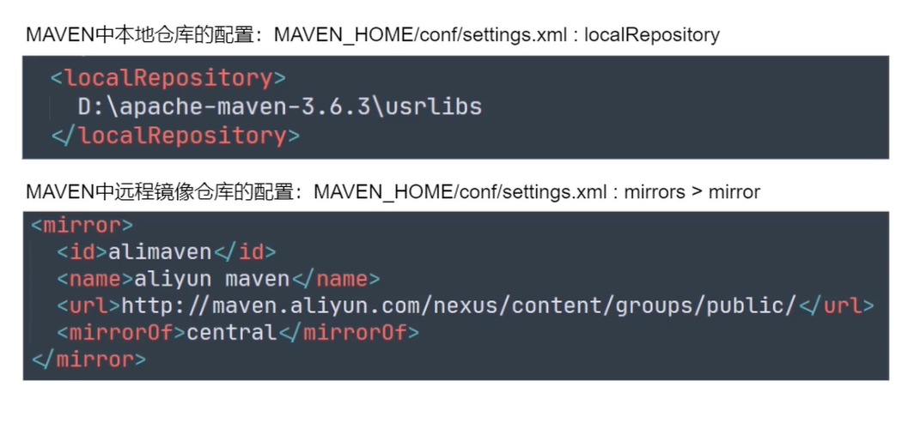
### Maven 核心组件： 配置
>* 全局配置：Maven软件中的settings.xml
```xml
<settings>
<localRepository/> //用于配置本地仓库，默认在用户目录下repository文件夹下
<interactiveMode/> //用于配置是否需要和用户交互。默认为true
<usePluginRegistry/> //用于配置是否通过pluginRegistry.xml来配置插件.默认为false.更多时候我们把插件配置，集成到pom.xml中
<offline/> //用于配置是否启用离线模式，默认false。如果长时间不需要联网操作，可以开启
<pluginGroups/>//用于配置，如果插件的groupId没有提供的情况下，自动搜索groupId
<servers/>//用于配置远程仓库所在的服务器，在访问时需要的身份认证信息，比如账号，密码等认证
<mirrors/>//用于给仓库列表配置对应的下载镜像列表
<proxies/>//用于配置连接仓库的代理
<profiles/>//用于全局配置项目构建参数的列表，完成特定环境的定制化操作，比如配置全局的jdk版本
<activeProfiles/> //用于手工激活profile配置，通过配置指定的profile ab选项。来完成profile配置的激活工作
<activation/>//是profile的一个扩展选项，指定某一些条件下自动切换profile配置
<properties/> // 用于在配置文件中声明扩展配置项。类似在编程语言中定义变量去使用
<repositories/> //用于配置远程仓库列表，用于项目开发时，多仓库的配置
<pluginRepositories/>
</settings>
```
>* 用户配置：settings.xmlnote
>* 项目配置：pom.xml
>* 优先级： pom.xml(项目配置) > settings.xmlnote(用户配置) > settings.xml(全局配置)
### Maven软件坐标
>* groupId: 项目ID,当前项目和其他项目的唯一标志
>* artifactId:组件ID，当前项目中的子应用或者子组件的唯一标志
>* version:版本号，迭代开发时标志的产品版本信息
#### 扩展：版本号的意义
>* 软件名称.主版本号.小版本号.阶段版本号.字母版本号
>* 主版本号：软件重大功能新增和修改
>* 小版本号：子版本号。小功能新增和修改
>* 阶段版本号：BUG修复
>* 字母版本号：里程碑版本 
>* ALPHA 内测版本
>* BETA 公测版本
>* RC 候选版本 即将发行
>* Stable 稳定版本
>* release /R/ GA
>* Final
### Maven命令操作
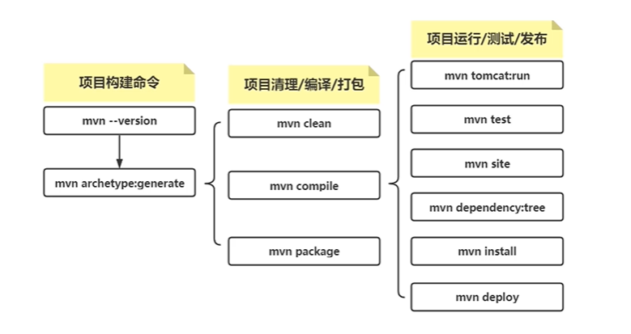
### Maven 生命周期
>* 生命周期：预定义项目执行过程，降低项目管理难度
>* clean lifecycle: 项目构建之前的清理环节
>* default lifecycle: 项目编译和打包环节
>* site lifecycle: 项目报告、站点信息、发布环节
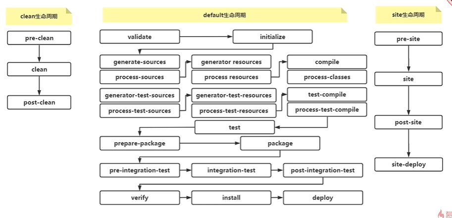
#### MVN 命令创建 Maven 项目
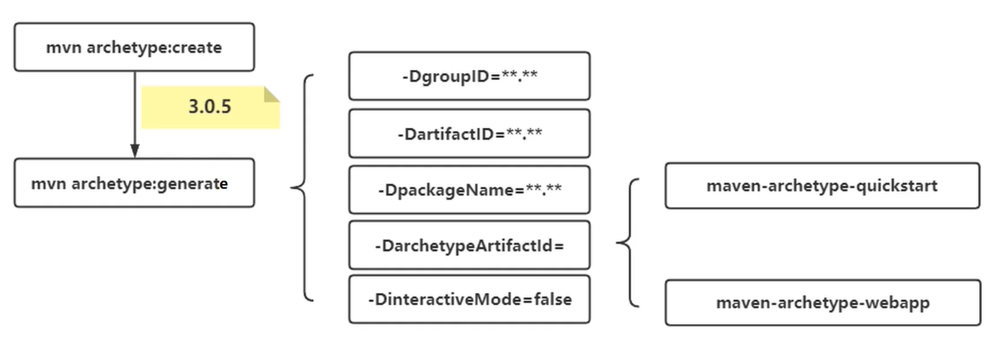
### Maven 依赖范围管理
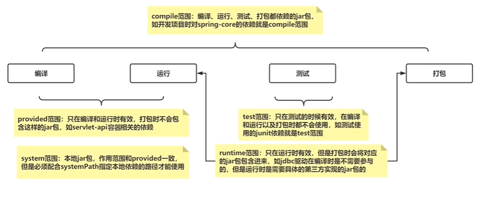
### Maven 父子项目依赖传递
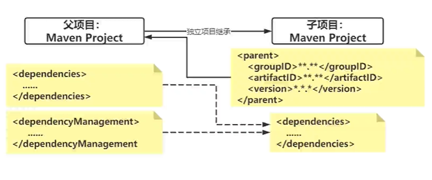
>* 父项目 ： <packaging>pom</packaging>
>* 父子项目，合理有效的复用依赖jar包
>* 子项目相互独立，更加便于敏捷开发和独立管理
>* 父子项目，项目之间的系统集成性能较差
### Maven 聚合项目管理
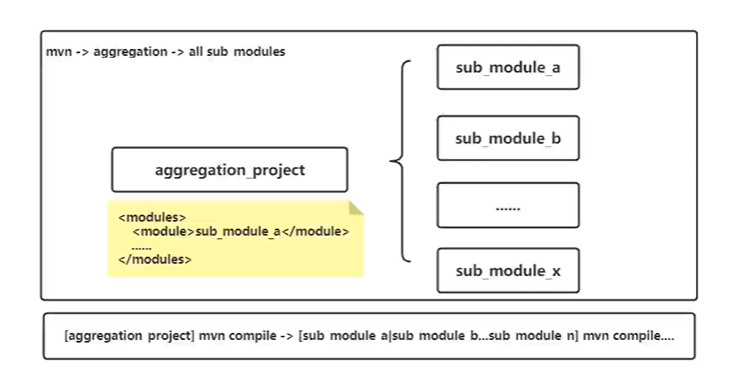
>* 项目聚合关系 项目之间的整体性较高，便于系统集成和维护
### Maven 构建JavaSE
>* JavaSE项目是使用纯Java代码开发的一些基本应用，在构建的过程中我们需要开发程序的入口类，并且指定具体的main方法
